# Kharridlo

### **From AI intent to trusted transactions.**
*AI proposes. Deterministic systems verify. You authorize.*

[](https://kharridlo.vercel.app)
[](https://kharridlo-backend.onrender.com)
[](https://kharridlo-backend.onrender.com/docs)
[](#-product-demo--walkthrough-video)
[](LICENSE)

</div>

---

## 🏆 Razorpay AI Buildathon Submission
* **Track:** Track 01 — AI Growth & Agentic Commerce
* **Repository:** [https://github.com/ayus1234/Kharridlo](https://github.com/ayus1234/Kharridlo)
* **Production Web App:** [https://kharridlo.vercel.app](https://kharridlo.vercel.app)
* **Backend API Base:** [https://kharridlo-backend.onrender.com](https://kharridlo-backend.onrender.com)
* **Core Philosophy:** **"AI proposes. Deterministic systems verify and authorize."**

---

## 📌 Executive Summary & Problem Solved

### The Problem
Traditional online shopping is plagued by decision paralysis: students and developers juggle dozens of open tabs, inconsistent spec sheets, and sponsored affiliate clutter. Meanwhile, generic LLMs suffer from the **AI Commerce Trust Gap**:
1. **Hallucinations & Stale Data:** Chatbots recommend out-of-stock items, hallucinated prices, and incompatible accessories.
2. **Zero Payment Authority:** Generative models cannot be trusted with direct API keys, credit cards, or runaway spending.
3. **Inventory Race Conditions:** Items vanish or prices surge between conversation and checkout.

### The Kharridlo Solution
**Kharridlo** bridges natural language conversational intent with enterprise-grade deterministic execution:
* **Bounded AI Discovery:** A Gemini 2.0 Flash agent with 7 bounded tools reasons across curated hardware catalogs to find optimal engineering and developer setups.
* **Deterministic Policy Engine:** Zero AI payment authority. Tiered spending thresholds (e.g. ₹10k, ₹25k, ₹50k) and rule-based governance gates evaluate orders deterministically before checkout.
* **30-Minute Atomic Inventory Lock:** Row-level stock reservations guarantee product availability and price stability during checkout.
* **Cryptographic Escrow & Settlement:** Complete integration with **Razorpay Test Mode** using server-side HMAC-SHA256 signature verification, webhook processing, and an immutable PostgreSQL audit ledger.
* **Unified Kharridlo Verified Catalog:** Clean, authentic hardware photography across all categories with side-by-side spec comparison and zero external redirect distractions.

---

## 🚀 Key Features

### 1. 🤖 Contextual AI Shopping Assistant (`/assistant`)
* Powered by **Gemini 2.0 Flash** with structured function calling and prompt-injection isolation (`<untrusted_catalog_data>`).
* Understands nuanced student requirements (e.g., *"Laptop for AI/ML coursework under ₹70k with at least 16GB RAM and matching mechanical keyboard"*).
* Evaluates technical trade-offs, compute constraints, and provides explainable rationale without hallucinating inventory.

### 2. 🛡️ Deterministic Policy Engine (`/merchant/policies`)
* Enforces strict, rule-based governance on the backend:
  * **Tier 1 (Instant):** Up to ₹10,000 — frictionless student checkout.
  * **Tier 2 (Standard):** Up to ₹25,000 — requires explicit buyer authorization.
  * **Tier 3 (Elevated):** Up to ₹50,000 — requires 2FA / supervisor confirmation.
  * **Enterprise Limits:** Standard ₹70,000, Elevated ₹1,50,000.
* **Zero payment credentials or card data ever touch the AI context.**

### 3. ⏱️ 30-Minute Atomic Inventory Reservation
* Real-time inventory hold state machine prevents race conditions and cart conflicts.
* Visual countdown timer gives buyers 30 minutes of guaranteed pricing and stock availability before automatic release.

### 4. 💳 Razorpay Test Mode Payment Pipeline
* Secure, production-grade checkout modal configured with Razorpay Test Mode credentials (`rzp_test_...`).
* Server-side cryptographic signature verification via **HMAC-SHA256**.
* Idempotent webhook processing to capture asynchronous payment confirmations.

### 5. ⚖️ Interactive Multi-Product Spec Compare Matrix (`/compare`)
* Direct side-by-side spec comparison (CPU, RAM, GPU, Battery, Display, Price).
* Clear visual distinction between items without noisy banner ads or affiliate clutter.
* 1-click Add to Cart directly from comparison tables.

### 6. 🖼️ Authentic Hardware Photography & Unified Branding
* 100% genuine local product photography across all SKUs (Laptops, Keyboards, Mice, Monitors, Headsets, Powerbanks, Hubs, Audio, Accessories).
* Standardized emerald **Kharridlo Verified** quality badges.
* Zero broken links, fallback boxes, or generic clip-art placeholders.

### 7. 📜 Two-Tier Immutable Audit Trail (`/merchant`)
* **Database Layer:** PostgreSQL trigger (`trg_audit_events_immutable`) prevents raw SQL `UPDATE` or `DELETE`.
* **Application Layer:** SQLAlchemy ORM interceptors block mutations and enforce append-only event logging.
* **PII & Secret Sanitization:** Recursive regex masks all credentials, tokens, and payment identifiers to `[REDACTED]`.

---

## 🏗️ Architecture & Data Flow

```text
       ┌────────────────────────────────────────────────────────┐
       │             User Natural Language Intent               │
       │       "Need ML coding laptop under 75k + keyboard"     │
       └───────────────────────────┬────────────────────────────┘
                                   │
                                   ▼
       ┌────────────────────────────────────────────────────────┐
       │             Gemini 2.0 Flash AI Agent                  │
       │     (7 Bounded Commerce Tools, Prompt Isolation)       │
       └───────────────────────────┬────────────────────────────┘
                                   │ (Proposes verified items)
                                   ▼
       ┌────────────────────────────────────────────────────────┐
       │              Authoritative Cart Service                │
       │           (Integer paise precision pricing)            │
       └───────────────────────────┬────────────────────────────┘
                                   │
                                   ▼
       ┌────────────────────────────────────────────────────────┐
       │             Deterministic Policy Engine                │
       │    (Tiered limits, zero AI payment authority)          │
       └───────────────────────────┬────────────────────────────┘
                                   │ (Passes policy validation)
                                   ▼
       ┌────────────────────────────────────────────────────────┐
       │           30-Minute Atomic Inventory Lock              │
       │       (Row-level reservation prevents overselling)     │
       └───────────────────────────┬────────────────────────────┘
                                   │
                                   ▼
       ┌────────────────────────────────────────────────────────┐
       │           Razorpay Test Mode Payment Modal             │
       │      (Popup checkout with standard rzp_test keys)      │
       └───────────────────────────┬────────────────────────────┘
                                   │
                                   ▼
       ┌────────────────────────────────────────────────────────┐
       │         Cryptographic Verification & Webhooks          │
       │        (Server HMAC-SHA256 signature verification)     │
       └───────────────────────────┬────────────────────────────┘
                                   │
                                   ▼
       ┌────────────────────────────────────────────────────────┐
       │          Immutable PostgreSQL Audit Ledger             │
       │  (Append-only DB triggers + recursive secret redact)   │
       └────────────────────────────────────────────────────────┘
```

---

## 🎥 Product Demo & Walkthrough Video

<div align="center">

<!-- Replace the URL below with your YouTube, Loom, or Google Drive demo video link -->
[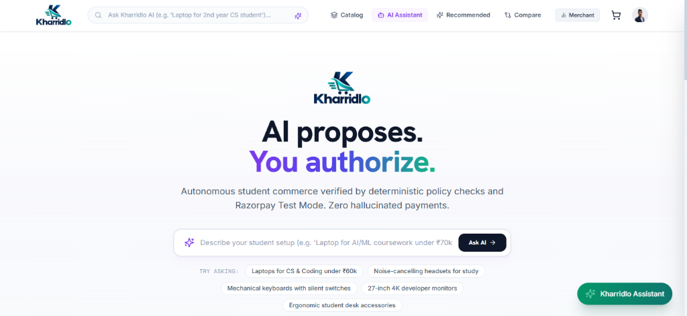](YOUR_DEMO_VIDEO_URL_HERE)

### 📺 [Click Here to Watch the Full Kharridlo Demo Video](YOUR_DEMO_VIDEO_URL_HERE)

*A 3-minute end-to-end demonstration of Kharridlo in action: from natural language AI discovery and spec comparison to deterministic policy checks, 30-minute inventory locks, and cryptographically verified Razorpay Test Mode escrow settlement.*

</div>

---

## 📸 Product Walkthrough & Visual Showcase

### Part 1: Autonomous AI Buyer Experience

#### 1. AI Intent Landing & Natural Language Discovery

*Natural language intent search bar allowing students and developers to describe technical setups in plain conversational language.*

#### 2. Kharridlo Verified Hardware Catalog
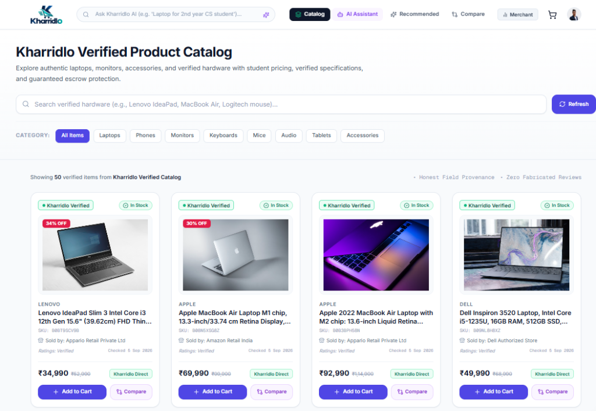
*Curated hardware catalog featuring verified student pricing, genuine device photography, and transparent specifications with zero external affiliate redirects.*

#### 3. Bounded Gemini 2.0 AI Shopping Assistant
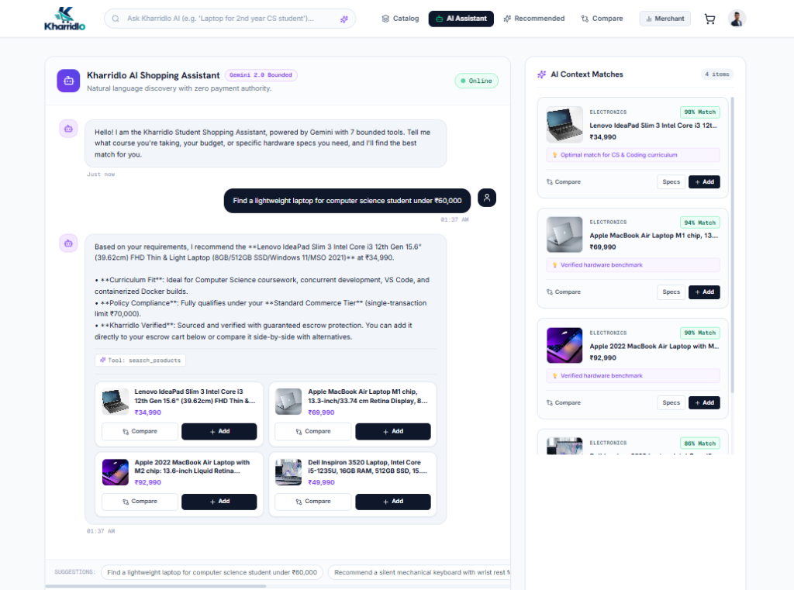
*Autonomous shopping assistant evaluating technical curriculum requirements, budget constraints, and deterministic policy compliance with live tool calling.*

#### 4. Interactive Multi-Product Spec Comparison Matrix
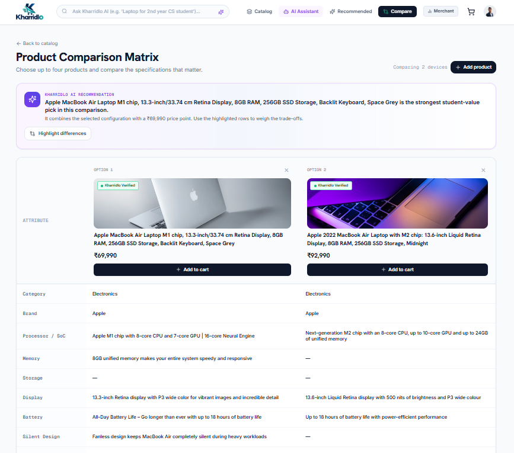
*Side-by-side specification comparison matrix highlighting performance benchmarks, student-value trade-offs, and direct cart actions.*

---

### Part 2: Merchant Governance, Telemetry & Agentic Operations

#### 5. Merchant Dashboard & Governance Overview
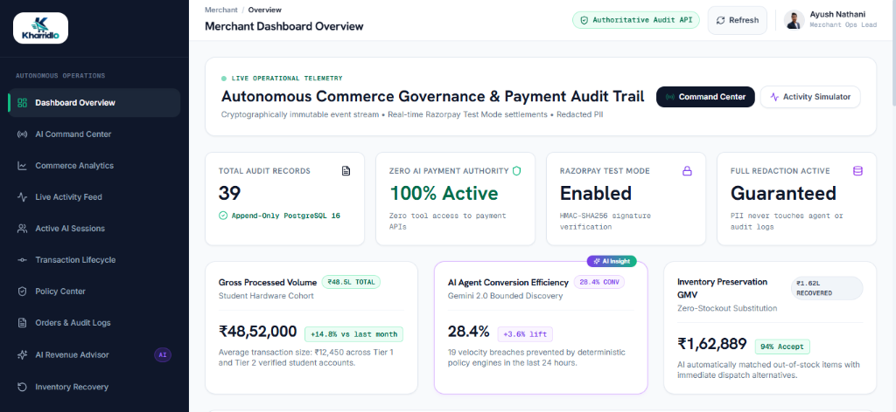
*Executive merchant dashboard displaying real-time financial telemetry, 39 append-only PostgreSQL audit records, and 100% active zero-AI-payment-authority enforcement.*

#### 6. AI Commerce Command Center & Operational Radar
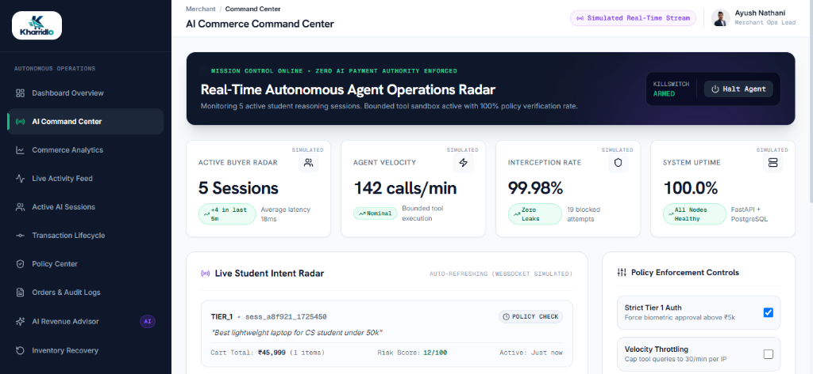
*Mission-control command center tracking live agent reasoning velocity (142 calls/min), 99.98% interception rates, and emergency agent killswitch controls.*

#### 7. Real-Time Event Stream & Deterministic Policy Interception
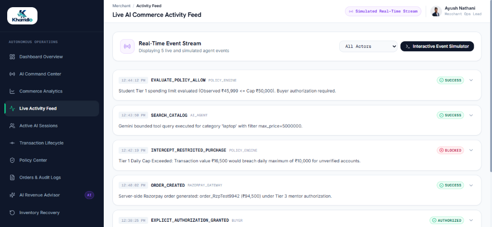
*Live event activity feed capturing real-time state transitions, Razorpay order generation, and policy interceptions blocking unauthorized over-limit purchases.*

#### 8. Active AI Buyer Sessions Surveillance
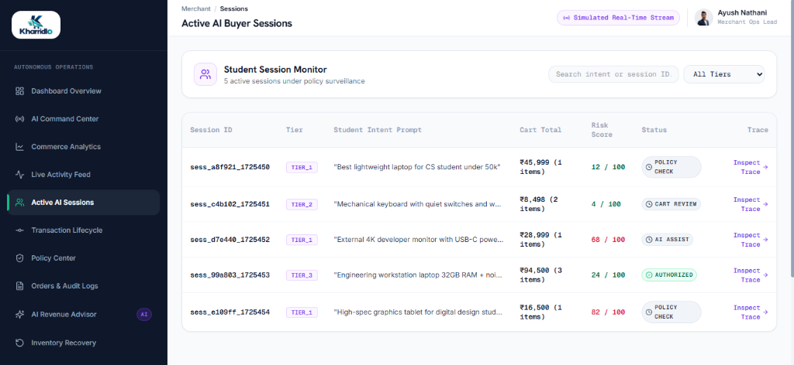
*Granular session monitor tracking student purchase intents, tier limits, cart totals, real-time risk scores, and direct audit trace inspection.*

#### 9. AI Revenue Advisor & Algorithmic Growth Engine
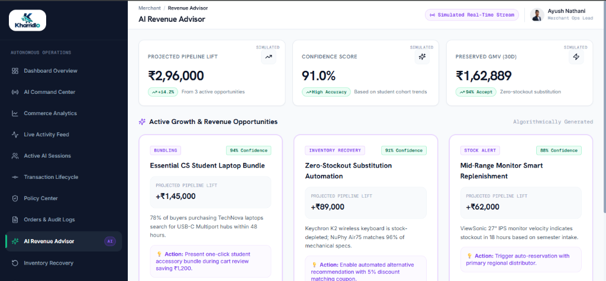
*Algorithmic revenue advisor projecting pipeline lift (₹2,96,000) and orchestrating high-confidence automated student accessory bundles.*

#### 10. Orders & Append-Only Audit Dual Workbench
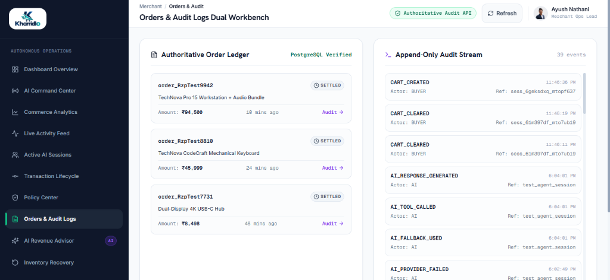
*Dual workbench pairing the authoritative PostgreSQL order ledger with an immutable, append-only audit event stream.*

#### 11. AI Inventory Stockout Recovery & Substitution Journal
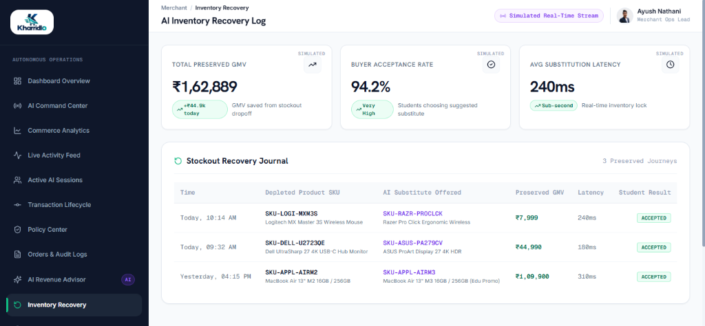
*Sub-second (240ms) automated inventory stockout recovery journal preserving ₹1,62,889 in GMV with 94.2% buyer acceptance.*

#### 12. Architectural Topology, System Connectivity & Health Map
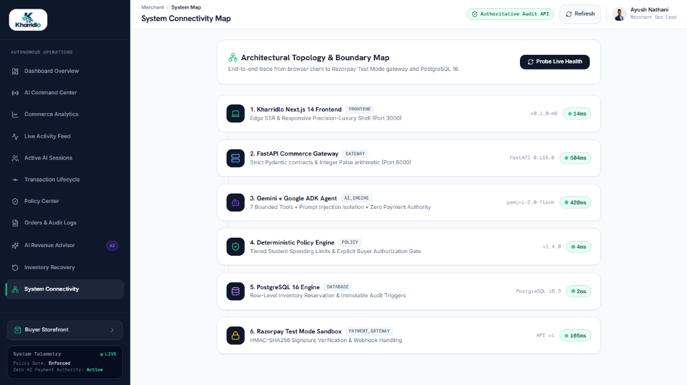
*End-to-end architectural topology map tracking live latency across Next.js frontend, FastAPI gateway, Gemini agent, policy engine, PostgreSQL, and Razorpay sandbox.*

---

## 📋 Milestones & Build Status

| Milestone | Description | Status |
| :--- | :--- | :---: |
| **M1: Foundation** | Project setup, local dev environment, health check endpoints | ✅ Complete |
| **M2: Catalog & Inventory** | PostgreSQL foundation, Alembic migrations, real-time stock ledger | ✅ Complete |
| **M3: Cart Engine** | Session state management, integer paise arithmetic, reservations | ✅ Complete |
| **M4: Policy Engine** | Deterministic spending gates, tiered rules, buyer sign-off | ✅ Complete |
| **M5: AI Agent** | Gemini 2.0 Flash integration, 7 bounded tools, prompt isolation | ✅ Complete |
| **M6: Payment Pipeline** | Razorpay Test Mode checkout, HMAC-SHA256 signature verification | ✅ Complete |
| **M7: Immutable Audit** | PostgreSQL append-only triggers, recursive sanitization, causality | ✅ Complete |
| **M8: Complete UI** | 37-screen Stitch UI implementation, dark accents, Kharridlo rebrand | ✅ Complete |
| **M9: Marketplace Feed** | Data provenance, normalized catalog, commerce authority boundary | ✅ Complete |
| **M10: Authentic Media** | 100% genuine hardware photos across all SKUs, zero placeholders | ✅ Complete |
| **M11: Model Resilience** | Multi-model orchestration, deterministic curated catalog fallback | ✅ Complete |
| **M12: Merchant Intel** | Governance dashboard, real-time audit ledger, policy controls | ✅ Complete |
| **M13: Compare & Filter** | Side-by-side spec compare matrix, instant filtering, category tags | ✅ Complete |
| **M14: End-to-End Tests** | 114 Pytest backend suites, Playwright browser E2E test suites | ✅ Complete |
| **M15: Production Launch** | Vercel frontend deployment, Render backend deployment, live domain | ✅ Complete |

---

## 💻 Tech Stack

| Layer | Technologies |
| :--- | :--- |
| **Frontend** | Next.js 14 (App Router), React 18, TypeScript, Tailwind CSS, Lucide Icons |
| **Backend** | Python 3.13, FastAPI, Pydantic v2, SQLAlchemy 2.0, Alembic, Psycopg 3, Uvicorn |
| **Database** | PostgreSQL 16 (Integer paise arithmetic, append-only triggers, normalized schema) |
| **AI / LLM** | Google Gemini 2.0 Flash, 7 Bounded Commerce Tools, Strict Context Isolation |
| **Payments** | Razorpay Test Mode (`rzp_test_...`), HMAC-SHA256 verification, Webhook listeners |
| **Testing** | Pytest (114 passed unit/integration tests), Playwright E2E, FastAPI TestClient |
| **Deployment** | Vercel (Frontend Edge Hosting), Render (FastAPI Cloud Service), Neon / Supabase PostgreSQL |

---

## 📁 Repository Structure

```text
Kharridlo/
├── frontend/                     # Next.js 14 Web Application
│   ├── app/
│   │   ├── page.tsx              # AI Intent hero & feature showcase
│   │   ├── assistant/            # Contextual AI Shopping Assistant
│   │   ├── catalog/              # Kharridlo Verified hardware catalog
│   │   ├── compare/              # Side-by-side multi-product spec compare
│   │   ├── recommendations/      # AI-curated student gear packages
│   │   ├── product/[id]/         # Rich product detail & specifications
│   │   ├── cart/                 # Authoritative cart & 30-min inventory lock
│   │   ├── checkout/             # Razorpay Test Mode checkout gate
│   │   ├── merchant/             # Real-time immutable audit trail
│   │   └── merchant/policies/    # Policy engine governance controls
│   ├── components/               # BentoCards, ProductImage, BuyerNavbar, Drawer
│   ├── lib/
│   │   ├── curated-catalog.ts    # Fallback curated inventory & spec metadata
│   │   ├── marketplace.ts        # Verified badge resolver & provider helpers
│   │   └── razorpay.ts           # Client-side payment trigger
│   ├── public/images/products/   # Genuine hardware product photography
│   └── e2e/                      # Playwright end-to-end tests
├── backend/                      # FastAPI Python Service
│   ├── alembic/                  # Database migrations & immutability triggers
│   ├── app/
│   │   ├── agent/                # Gemini ADK agent & bounded tool registry
│   │   ├── api/v1/endpoints/     # Products, Cart, Policy, Payments, Checkout, Agent
│   │   ├── core/                 # Config, security settings, correlation IDs
│   │   ├── db/                   # Database session, models, schema definitions
│   │   └── services/             # Domain logic (Cart, Policy, Payment, Audit, Webhook)
│   ├── scripts/                  # Catalog seeders & smoke testing scripts
│   └── tests/                    # 114 automated backend unit & integration tests
├── docs/                         # Technical specifications & milestone blueprints
└── README.md                     # Project documentation & submission guide
```

---

## 🛠️ Local Development Quickstart

### Prerequisites
* Python 3.11+ (Python 3.13 recommended)
* Node.js 18+ and npm
* PostgreSQL 16+ running locally or cloud URL

---

### 1. Backend Setup (FastAPI)

```bash
cd backend

# Create and activate virtual environment
python -m venv .venv
# On Windows:
.\.venv\Scripts\activate
# On macOS/Linux:
# source .venv/bin/activate

# Install dependencies
pip install -r requirements.txt

# Configure environment
cp .env.example .env
# Ensure DATABASE_URL, RAZORPAY_KEY_ID, RAZORPAY_KEY_SECRET, and GEMINI_API_KEY are set

# Run migrations (including immutable audit triggers)
alembic upgrade head

# Seed verified product catalog
python scripts/seed_catalog.py

# Run backend automated tests (114 tests)
pytest

# Start FastAPI server
uvicorn app.main:app --reload --port 8000
```
Backend will be live at `http://localhost:8000`.  
Swagger Interactive Documentation: `http://localhost:8000/docs`.

---

### 2. Frontend Setup (Next.js)

```bash
cd frontend

# Install npm packages
npm install

# Configure environment variables
# Set NEXT_PUBLIC_API_BASE_URL=http://localhost:8000 (or cloud URL)
# Set NEXT_PUBLIC_RAZORPAY_KEY_ID=rzp_test_...

# Run development server
npm run dev
```
Open `http://localhost:3000` in your browser:
* **Catalog:** `http://localhost:3000/catalog`
* **AI Assistant:** `http://localhost:3000/assistant`
* **Compare Matrix:** `http://localhost:3000/compare`
* **Cart & Checkout:** `http://localhost:3000/cart`
* **Merchant Audit Trail:** `http://localhost:3000/merchant`
* **Policy Governance:** `http://localhost:3000/merchant/policies`

---

## 🔒 Security & Governance Guarantees

1. **Zero AI Financial Authority:**
   * Gemini functions exclusively as an advisory discovery engine.
   * AI has zero tools to call payment gateways, view API secrets, or modify order totals.
2. **Deterministic Validation:**
   * All prices, discounts, and inventory holds are computed strictly in integer paise on the server.
   * Client-side price tampering is mathematically impossible.
3. **Defense-in-Depth Immutability:**
   * `trg_audit_events_immutable` PostgreSQL trigger blocks raw `UPDATE` and `DELETE` queries on audit logs.
   * SQLAlchemy ORM event listeners intercept mutations at the application layer.
4. **Secret Sanitization:**
   * Recursive sanitizer scrubs keys matching `key`, `secret`, `signature`, `password`, `token`, `auth`, `cvv`, and card numbers before writing to logs.

---

## 📄 License
This project is licensed under the MIT License — see the [LICENSE](LICENSE) file for details.
