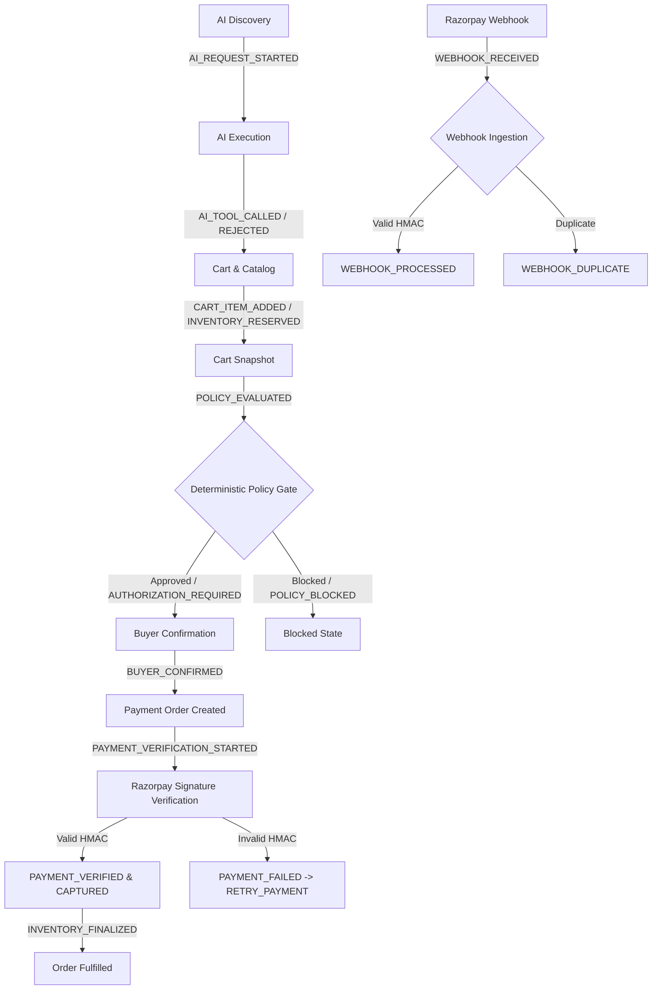

# Milestone 7 — Immutable Audit Trail and Failure Handling Polish

**Product Name:** Kharridlo  
**Core Architectural Principle:** *AI proposes. Deterministic systems verify and authorize.*  
**Status:** Completed & Fully Verified  

---

## 1. Executive Summary

Milestone 7 establishes an enterprise-grade, append-only, cryptographic, and defense-in-depth audit trail for the entire commerce lifecycle of Kharridlo. Every operation across AI discovery, cart mutations, policy enforcement, buyer authorization, Razorpay checkout, cryptographic signature verification, public webhook delivery, inventory deduction, and state conflict recovery is recorded with microsecond timestamps and complete correlation tracking.

### Key Objectives Achieved:
1. **Append-Only Immutability:** Enforced at both application layer (SQLAlchemy ORM `before_update` and `before_delete` event hooks raising `AuditImmutabilityError`) and database engine layer (PostgreSQL trigger `trg_audit_events_immutable` preventing raw SQL UPDATE and DELETE).
2. **Recursive Secret & Payment Card Sanitization:** Pre-storage and query-time recursion sanitizes all nested dictionaries, lists, and strings. Tokens matching `secret`, `key`, `signature`, `password`, `token`, `auth`, `cvv`, and card patterns are converted to `[REDACTED]`.
3. **Structured Failure Codes & Recovery Actions:** Every rejection, signature mismatch, policy block, or webhook failure captures `reason_code`, `failure_code`, and an explicit `recovery_action` (e.g. `RETRY_PAYMENT`, `VIEW_COMPLETED_ORDER`, `DEFENSIVE_FALLBACK`).
4. **Idempotency Deduplication:** Webhook deliveries and payment verification retries leverage `idempotency_key` indexes to prevent duplicate fulfillment or audit event flooding.
5. **Merchant Governance Timeline API:** `GET /api/v1/payments/audit` provides multi-parameter filtering across `session_id`, `order_id`, `checkout_id`, `razorpay_order_id`, `correlation_id`, `event_type`, `event_status`, `actor_type`, `product_id`, and date ranges with stable descending chronological ordering.

---

## 2. Audit Model & Schema

The audit event model in [`backend/app/models/payment.py`](file:///c:/Users/hp/Downloads/New%20folder%20(12)/Kharridlo/backend/app/models/payment.py) was extended with canonical metadata fields:

| Field Name | Type | Constraints / Purpose |
| :--- | :--- | :--- |
| `id` | String(36) | Primary Key (`audit_` UUID) |
| `event_type` | String(64) | Indexed event taxonomy identifier |
| `event_status` | String(32) | Indexed status (`attempted`, `succeeded`, `failed`, `rejected`, `recovered`) |
| `actor_type` | String(32) | Indexed actor (`BUYER`, `AI`, `SYSTEM`, `PAYMENT_PROVIDER`, `WEBHOOK`) |
| `session_id` | String(128) | Indexed browser/user session |
| `checkout_id` | String(36) | Indexed checkout session linkage |
| `order_id` | String(36) | Indexed internal order identifier |
| `razorpay_order_id` | String(64) | Indexed Razorpay order reference |
| `razorpay_payment_id`| String(64) | Indexed Razorpay payment reference |
| `payment_attempt_id`| String(36) | Indexed payment attempt link |
| `product_id` | String(64) | Indexed catalog product reference |
| `correlation_id` | String(64) | Indexed distributed tracing ID (`req_` / UUID) |
| `parent_event_id` | String(36) | Causality tracking / DAG parent event |
| `provider` | String(32) | AI / Payment provider (`razorpay`, `gemini`, `deterministic`) |
| `model` | String(64) | Model designation (`gemini-2.5-flash`, `deterministic-rules`) |
| `request_id` | String(64) | Upstream provider request identifier |
| `reason_code` | String(64) | High-level business reason code |
| `failure_code` | String(64) | Machine-readable failure classification |
| `recovery_action` | String(64) | Recommended deterministic next action |
| `idempotency_key` | String(128) | Unique constraint for deduplication |
| `metadata_json` | JSON | Sanitized structured event details |
| `created_at` | DateTime(UTC) | Immutable creation timestamp |

---

## 3. Canonical Event Taxonomy



### Event Groups:
- **AI Gateway:** `AI_REQUEST_STARTED`, `AI_RESPONSE_GENERATED`, `AI_TOOL_CALLED`, `AI_TOOL_REJECTED`, `AI_PROVIDER_FAILED`, `AI_FALLBACK_USED`, `AI_PROMPT_INJECTION_DETECTED`
- **Catalog:** `PRODUCT_SEARCHED`, `PRODUCT_VIEWED`
- **Cart & Inventory:** `CART_CREATED`, `CART_ITEM_ADDED`, `CART_ITEM_UPDATED`, `CART_ITEM_REMOVED`, `CART_CLEARED`, `INVENTORY_RESERVED`, `INVENTORY_RESERVATION_RELEASED`, `INVENTORY_FINALIZATION_STARTED`, `INVENTORY_FINALIZED`, `INVENTORY_FINALIZATION_SKIPPED`
- **Policy Engine:** `POLICY_EVALUATED`, `POLICY_BLOCKED`, `AUTHORIZATION_REQUIRED`, `POLICY_REVALIDATED`
- **Checkout Session:** `CHECKOUT_INITIATED`, `BUYER_CONFIRMED`, `BUYER_AUTHORIZATION_GRANTED`, `BUYER_AUTHORIZATION_DENIED`, `CHECKOUT_CANCELLED`, `CHECKOUT_EXPIRED`
- **Payment Lifecycle:** `PAYMENT_ORDER_CREATED`, `PAYMENT_VERIFICATION_STARTED`, `PAYMENT_VERIFIED`, `PAYMENT_CAPTURED`, `PAYMENT_FAILED`, `PAYMENT_CANCELLED`, `PAYMENT_STATE_CONFLICT`, `PAYMENT_DUPLICATE_REQUEST`
- **Webhook Gateway:** `WEBHOOK_RECEIVED`, `WEBHOOK_SIGNATURE_INVALID`, `WEBHOOK_DUPLICATE`, `WEBHOOK_IGNORED`, `WEBHOOK_PROCESSED`, `WEBHOOK_PROCESSING_FAILED`

---

## 4. Immutability Architecture

### Two-Tier Immutability Defense:

1. **Application Layer (SQLAlchemy ORM):**
   Attached event listeners intercept any state mutations before they are committed:
   ```python
   @event.listens_for(AuditEvent, "before_update")
   def _prevent_audit_update(mapper, connection, target):
       raise AuditImmutabilityError("Audit events are strictly append-only and cannot be updated.")

   @event.listens_for(AuditEvent, "before_delete")
   def _prevent_audit_delete(mapper, connection, target):
       raise AuditImmutabilityError("Audit events are strictly append-only and cannot be deleted.")
   ```

2. **Database Engine Layer (PostgreSQL Trigger):**
   Enforced via Alembic migration `5c1736e5414e_add_audit_immutability_trigger`:
   ```sql
   CREATE OR REPLACE FUNCTION prevent_audit_events_mutation()
   RETURNS TRIGGER AS $$
   BEGIN
       RAISE EXCEPTION 'Audit events table is append-only. UPDATE and DELETE operations are strictly prohibited.';
   END;
   $$ LANGUAGE plpgsql;

   CREATE TRIGGER trg_audit_events_immutable
   BEFORE UPDATE OR DELETE ON audit_events
   FOR EACH ROW
   EXECUTE FUNCTION prevent_audit_events_mutation();
   ```

---

## 5. Sanitization & Redaction Rules

To strictly enforce data privacy and PCI-DSS compliance, `sanitize_audit_metadata` executes recursively on write and read:
- **Redacted Tokens:** Any key containing substrings `secret`, `key`, `signature`, `password`, `token`, `authorization`, `auth`, `api_key`, `key_secret`, `webhook_secret`, `card`, `cvv`, `card_number`, `payment_method_details`, `raw_request_headers`, or `raw_response_headers`.
- **Value Replacement:** Overwritten with `"[REDACTED]"`.
- **Card Numbers:** Cleaned and scrubbed across all payload objects.
- **Audit Logs:** Never contain live or test Razorpay Key Secrets, Webhook Secrets, JWTs, or session passwords.

---

## 6. Verification & Test Evidence

### Backend Pytest Suite:
- Total Tests: **105 Passed** in 12.59s
- Dedicated Milestone 7 Suite ([`backend/tests/test_audit_trail.py`](file:///c:/Users/hp/Downloads/New%20folder%20(12)/Kharridlo/backend/tests/test_audit_trail.py)):
  - `test_audit_event_creation_and_fields` — PASSED
  - `test_audit_event_orm_update_prevented` — PASSED (asserts `AuditImmutabilityError`)
  - `test_audit_event_orm_delete_prevented` — PASSED (asserts `AuditImmutabilityError`)
  - `test_audit_event_sql_trigger_prevents_update` — PASSED (asserts PostgreSQL trigger rejection)
  - `test_audit_event_sql_trigger_prevents_delete` — PASSED (asserts PostgreSQL trigger rejection)
  - `test_sanitize_audit_metadata_redaction` — PASSED (verifies recursive redaction)
  - `test_correlation_id_continuity_in_audit` — PASSED (verifies parent-child lineage)
  - `test_idempotent_audit_logging_with_key` — PASSED (verifies deduplication)
  - `test_merchant_audit_timeline_api_filters` — PASSED (verifies session, order, event type filters)
  - `test_payment_failure_and_cancellation_metadata` — PASSED (verifies retryable recovery actions)

### Playwright E2E Suite:
- Total Tests: **6 Passed** in 11.6s
  - `1. Catalog product discovery and category filtering` — PASSED
  - `2. Add product to cart and verify authoritative total` — PASSED
  - `3. Deterministic Policy Gate and Buyer Authorization workflow` — PASSED
  - `4. Server-side payment order initiation and Checkout trigger` — PASSED
  - `5. Merchant Audit Dashboard visibility and real-time records` — PASSED
  - `6. Session isolation between independent browser contexts` — PASSED
